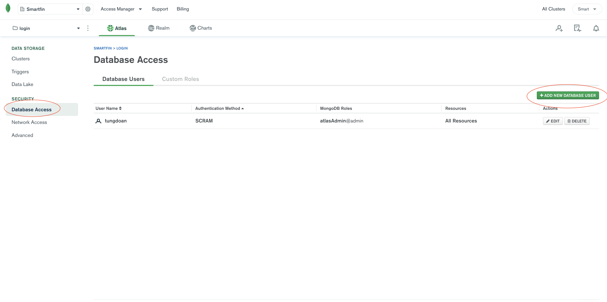

# MongoDB containing user info

---

## Setup

1. Run "npm install"
1. In your editor, create a new file in the backend folder and name it ".env"
1. Copy the contents of "sample.env" to ".env"
1. Visit [mongodb.com](https://www.mongodb.com/) and sign in with email
   1. Email: e4esmartfin@gmail.com
   1. Password: _\*check slack\*_
1. Navigate to "Database Access" in the left panel and press "Add new database user"
   > 
1. Enter a user name and a password (leaving everything else as default) and press "Add User"
1. Back in the ".env" file, replace **<FAKE_USER>** and **<FAKE_PASSWORD>** with your own user name and password
1. Run "npm start" in the terminal. If the last message printed is "MongoDB connection established" you're good to go!
